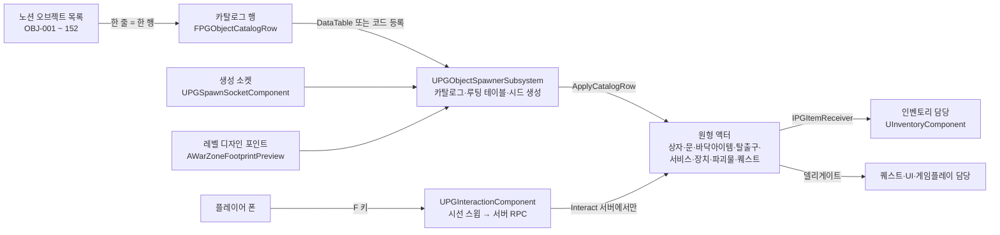
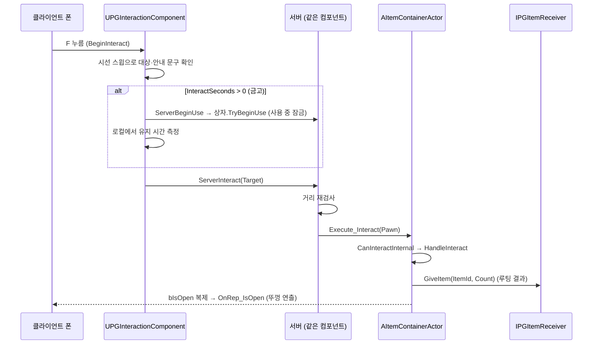

# ProjectPG 오브젝트 원형 구현 — 2026-09-13

노션 「ProjectPG 오브젝트 관리 목록」 152개 항목을 **원형(archetype) 9개 + 데이터(카탈로그 행)** 로 구현한 기록이다.
항목마다 클래스를 만들지 않는다는 노션 규칙을 코드로 옮긴 것이고, 이 문서는 그 구조와 검증 방법, 팀 저장소로 옮기는 절차를 담는다.

## 한 줄 상태

- 코드: `Source/ProjectPG/{Public,Private}/Objects/` 에 원형 9개, 컴포넌트 5개, 스포너 서브시스템, 상호작용 컴포넌트, 스모크 테스트.
- 데이터: 노션 확정 항목 104행이 코드 카탈로그(`PGObjectSmokeTest.cpp::RegisterDefaultCatalog`)와 `Docs/DT_PGObjectCatalog.csv`, `Docs/DT_PGLootTables.csv` 로 존재.
- 검증: 헤드리스 스모크 테스트 38/38 통과 (`PGObjectSmokeTest summary: passed=38 failed=0`).
- 아직 안 한 것: 실제 메시로 PIE에서 눈으로 확인, 팀 저장소(`ProjectPG` 모듈)로 이식, 노션 「구현 상태」 열 갱신, 검토 필요 항목 팀 결정.

## 구조





## 원형 ↔ 노션 항목

| 원형 | 클래스 / 파일 | 노션 항목 | 데이터로 갈리는 것 |
|---|---|---|---|
| 아이템 상자 | `AItemContainerActor` (`Actors/ItemContainerActor.*`) | OBJ-001 ~ 011 | 메시, 뚜껑 메시, LootTableId, 잠금·열쇠, 여는 시간 |
| 문 | `APGDoorActor` | OBJ-012 ~ 023, 탈출용 문 021/022 | 문짝 메시 1~2장, Motion(회전·미닫이·셔터·해치), 잠금, 자동 닫힘 |
| 바닥 아이템 | `APGFloorItemActor` | OBJ-027 ~ 052 | ItemId, 수량, 메시 |
| 탈출구 | `APGExtractionZoneActor` | OBJ-057 ~ 068, 077 | 대기 시간, 필요 아이템, 허용 플레이어, 활성 시간, 사용 횟수, Overlap/F 시작 |
| 시체 루팅 | `UPGLootableComponent` (기존 캐릭터에 부착) | OBJ-053 ~ 056 | LootTableId 또는 지정 내용물 |
| 서비스 | `APGServiceInteractionActor` | OBJ-078 ~ 085 | 상점/택배, 사용 위치 거리·각도 |
| 작동 장치 | `APGDeviceActor` | OBJ-089, 096 ~ 107 | 토글/버튼/시간제한/압력판, 필요 아이템, 연결 대상 |
| 파괴물 | `APGDestructibleActor` | OBJ-025, 108 ~ 115 | 체력, 아무 피해/폭발만/도구만, 폭발 반경 |
| 퀘스트 | `APGQuestObjectActor`, `APGQuestTriggerVolume` | OBJ-086 ~ 095 | 조사/납품/작동, 필요 아이템·수량, 플레이어별 1회 |
| 생성 지점 | `UPGSpawnSocketComponent`, `APGSpawnSocketActor` | OBJ-116 ~ 133 | 소켓 종류, Tier, 확률, 배타 그룹, 허용 ID |
| 차량 요소 | `UPGSeatComponent`, `UPGFuelComponent` | OBJ-072 ~ 076 | 운전석 여부, 탑승·하차 오프셋, 연료 용량 |
| 환경 요소 | 코드 없음 | OBJ-134 ~ 152 | StaticMesh·Level Instance (레벨 담당) |

공통 부품:

- `APGInteractableActorBase`: ObjectId, 표시 이름, QuestTag, InteractSeconds, 사용 중 잠금(CurrentUser), 서버 권한 검사, `ApplyCatalogRow`.
- `UPGLockComponent`: 잠김 상태 복제, 열쇠 확인·소모. 상자·문·게이트가 공유한다.
- `IPGItemReceiver` + `UPGItemReceiverLibrary`: 오브젝트 → 인벤토리 경계. 오브젝트 코드는 인벤토리 헤더를 포함하지 않는다.
- `IPGDeviceSignalTarget`: 장치 → 문·경보 신호 경계.
- `UPGObjectSettings` (프로젝트 설정 > Game > ProjectPG Objects): 카탈로그·루팅 DataTable 경로, 자동 생성 켜기.

## 서버 권한과 복제 규칙

- 상태를 바꾸는 코드는 전부 `HasAuthority()` 안에서만 돈다. 클라이언트에서 `Interact`를 직접 부르면 경고만 남긴다.
- 클라이언트 입력은 `UPGInteractionComponent`의 Server RPC(`ServerInteract`)를 거친다. 폰이 소유한 컴포넌트라 RPC가 허용되고, 서버가 거리를 다시 잰다.
- 복제되는 값: 열림·잠김·켜짐·파괴·사용 중 폰·남은 사용 횟수. 연출(뚜껑, 문짝, 충돌 해제)은 `OnRep_*`에서 서버·클라이언트 모두 실행한다.
- 정적 메시·소켓 마커는 복제하지 않는다. 서버 설계도(9/27 구현: 논리 격자 설계도 복제, `MultiplayerAudit_2026-09-27.md`)에 시드와 소켓 결과만 실어 보내면 클라이언트가 같은 카탈로그로 재현할 수 있게 `SpawnAllSockets(Seed)`는 결정적이다(스모크 테스트 `sockets_deterministic_for_seed`).

## 포함·제외 정책 (노션 규칙 그대로)

- 관리 상태 **확정** 항목만 `bIncluded=true`. 생성 후보가 된다.
- **검토 필요 / 제외 / 보류** 항목(창문, 작동 장치 전부, 파괴물 전부, 플레이어 시체, 차량 좌석, 제조 NPC, 제조 레시피, OBJ-008/087 중복 상자)은 카탈로그에 행은 있지만 `bIncluded=false`. 원형 코드는 준비돼 있으므로 팀 승인 후 값만 켜면 된다.
- 행을 지우지 않는다. 노션과 같은 ID(OBJ-xxx)를 유지한다.

## 실행·검증 방법

PIE 콘솔(`~`):

```
PG.ObjectSmokeTest            원형 전부 스폰해 검사, 로그에 pass=true/false
PG.SpawnObjectsFromPoints     현재 맵의 Loot/Exit/Quest 포인트에 카탈로그 오브젝트 생성 (맵 시드 사용)
```

에디터 없이(헤드리스, 약 1분):

```bash
"C:\Program Files\Epic Games\UE_5.6\Engine\Binaries\Win64\UnrealEditor-Cmd.exe" "E:\TestProject2\ProjectPG.uproject" "/Engine/Maps/Entry?game=/Script/ProjectPG.PGObjectTestGameMode" -game -nullrhi -unattended -nosound -nosplash -log -PGObjectSmokeTest "-PGExportObjectCatalog=E:\TestProject2\Docs"
```

- 결과는 `Saved/Logs/ProjectPG.log`에서 `PGObjectSmokeTest summary` 와 `pass=false` 검색.
- `-PGExportObjectCatalog=<폴더>` 를 주면 `DT_PGObjectCatalog.csv`, `DT_PGLootTables.csv` 를 다시 쓴다.

직접 걸어 다니며 보기:

1. `LD_MetaballGenerationTest` 에서 PIE. 검증용 캐릭터(`ALevelDesignValidationCharacter`)에 상호작용 컴포넌트가 붙어 있다.
2. 콘솔에서 `PG.SpawnObjectsFromPoints`.
3. Loot 포인트로 가서 상자를 보고 **F**. 금고는 5초 유지. 로그에 `Container ... loot ... given=true` 와 `ValidationCharacter inventory: +N` 이 찍힌다.

CSV를 DataTable로 쓰려면:

1. 콘텐츠 브라우저에서 `Docs/DT_PGObjectCatalog.csv` 가져오기 → Row Type `PGObjectCatalogRow`. 루팅은 `PGLootTableRow`.
2. 프로젝트 설정 > Game > ProjectPG Objects 에 두 DataTable 지정.
3. 이후 값 수정은 DataTable에서 한다. 코드 카탈로그는 DataTable이 없을 때의 기본값이다.

## 팀 저장소(origin/main, `ProjectPG` 모듈)로 옮기기

팀 main에는 이미 `ACustomPlayerCharacter`, `UInventoryComponent::AddItemByID`, `IA_Interaction` 입력 자산, `Input_Interaction` 게임플레이 태그가 있다. 오브젝트 쪽은 다음만 하면 붙는다.

1. `Source/ProjectPG/{Public,Private}/Objects/` 와 `Actors/ItemContainerActor.*`, `Interaction/Interactable.*` 를 `Source/ProjectPG/` 아래 같은 폴더로 복사.
2. `PROJECTPG_API` → `PROJECTPG_API` 치환. `UPGObjectSettings` 의 `RowType` 메타에서 `/Script/ProjectPG.` → `/Script/ProjectPG.`.
3. `ProjectPG.Build.cs` 에 `"DeveloperSettings"` 추가.
4. `ACustomPlayerCharacter` 가 `IPGItemReceiver` 를 구현: `ReceiveItem` → `InventoryComponent->AddItemByID(ItemId, PocketGuid, Count)`, `HasItem/ConsumeItem` → 인벤토리 조회·제거 함수, `GetPlayerKey` → PlayerState 의 계정 ID.
5. `UPGInteractionComponent` 를 캐릭터에 붙이고, `Input_Interaction` 의 NativeAction 에서 `Started → BeginInteract`, `Completed/Canceled → EndInteract`.
6. `SpawnFromLevelDesignPoints` 는 Test2 전용(`AWarZoneFootprintPreview`)이므로 팀 쪽에서는 `SpawnAllSockets(Seed)` 만 쓰거나, 팀 맵 생성기가 포인트를 넘기도록 어댑터를 하나 둔다.

## 남은 일 · 팀 협의 필요

- 실제 메시로 뚜껑·문짝 피벗 위치 맞추기 (BP 자식에서 상대 위치 조정).
- 루팅 UI: 지금은 상자를 열면 전부 인벤토리로 밀어 넣는다. UI 담당이 `GetLastLoot()` 를 읽어 하나씩 옮기는 방식으로 바꾸면 된다.
- 잠금 오브젝트 열쇠 소모 여부(기본 소모 안 함), 플레이어 시체 정책, OBJ-008/087 중복, 차량 탑승 — 노션 「검토 필요」 그대로.
- 노션 「구현 상태」 열을 미착수 → 진행중으로 바꾸는 것은 팀이 보는 표라 손대지 않았다.

## 면접에서 설명할 때 붙잡을 다섯 가지

1. **왜 클래스 152개가 아니라 원형 9개인가** — 행동이 같고 데이터만 다른 것은 같은 클래스여야 한다. 새 클래스는 "데이터로 표현할 수 없는 새 행동"이 생길 때만.
2. **왜 상자가 인벤토리 헤더를 모르는가** — `IPGItemReceiver` 경계. 오브젝트 담당과 인벤토리 담당이 서로 코드를 안 고치고도 합쳐진다.
3. **왜 Interact가 서버에서만 도는가** — 두 사람이 같은 상자를 같은 프레임에 열면 서버의 첫 호출만 성공해야 한다. 사용 중 잠금(CurrentUser)은 유지형 상호작용에서 그 역할을 한다.
4. **왜 시드로 소켓을 채우는가** — 같은 시드 = 같은 맵. 서버가 Manifest에 시드만 보내도 클라이언트가 같은 자리에 같은 상자를 만들 수 있다.
5. **왜 Tick을 끄고 시작하는가** — 맵 한 판에 오브젝트 수백 개. 뚜껑이 움직이는 0.4초, 문이 도는 0.7초에만 켠다.
